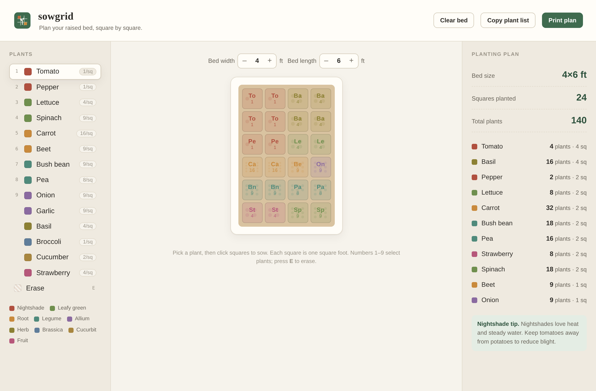

<p align="center">
  
</p>

<h1 align="center">sowgrid</h1>

<p align="center"><em>Plan your raised bed, square by square.</em></p>



## What it is

**sowgrid** is a clean, no-fuss planner for square-foot gardening. Set the size of
your raised bed, pick from a curated list of common vegetables and herbs, and click
squares to lay out your garden. Every square is one square foot, and sowgrid tracks
how many plants fit per square so you always know exactly how much to buy and grow.

It runs entirely in the browser — no account, no sign-up, nothing to install.

## Who it's for

Home gardeners, allotment holders, and first-time growers who want a tidy plan
before they buy seedlings. It's especially handy for the square-foot method, where
spacing is everything and a little planning saves a lot of wasted seed.

## Features

- **Adjustable bed** — size your plot from 2×2 up to 8×10 feet.
- **Family colour coding** — every plant is grouped by botanical family
  (nightshade, legume, allium, brassica and more) so your layout is readable at a
  glance and crop rotation is easier to reason about.
- **Correct spacing built in** — sowgrid knows how many of each crop fit in one
  square foot, from a single tomato to sixteen carrots.
- **Live planting plan** — a running tally of squares used, total plants, and a
  per-crop breakdown you can copy to your shopping list.
- **Companion tips** — a contextual growing note based on what dominates your bed.
- **Print-ready** — a clean print layout so you can take the plan out to the garden.
- **Keyboard friendly** — number keys select plants, `E` erases.

## How to use

1. Open `index.html` in any modern browser.
2. Set your bed width and length with the steppers.
3. Choose a plant from the left, then click squares to sow it.
4. Watch the planting plan on the right update, then **Copy plant list** or
   **Print plan** when you're happy.

## Running locally

No build step. Clone the repo and open the file:

```
git clone https://github.com/brod-dev/sowgrid.git
cd sowgrid
open index.html      # or just double-click it
```

## License

MIT — see [LICENSE](LICENSE). Artwork and code are original.
